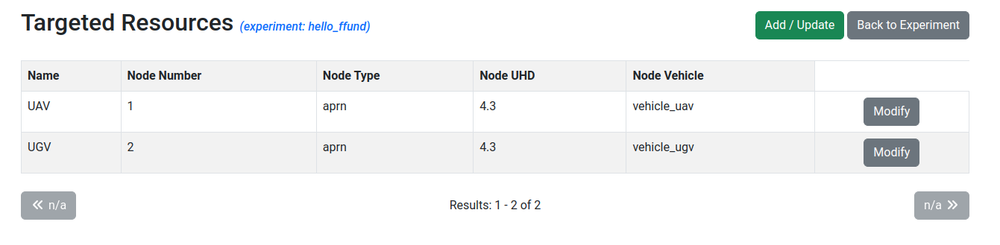

## Start an experiment

Now, you are ready to run an experiment on AERPAW!

In this "Hello, AERPAW" experiment, you are going to set up an experiment with two mobile vehicles: one aerial vehicle (UAV) and one ground vehicle (UGV). 

Note: If you are working as a group, one member of the group should complete the steps in "Add members and resources to your experiment" on behalf of the entire group, to create a single AERPAW experiment to be used by all members of the group. Then, each group member should (separately) try to run the experiment from "Access experiment resources" until the end.

#### Add members and resources to your experiment

First, log in to the AERPAW Experiment Portal. Click on "Projects" in the navigation bar, and find the project that you are a member of; click on it to open the project overview. Click on the "Create" button in the "Experiments" section. 

>[!NOTE] 
>Usually, before you begin an experiment on AERPAW you will fill in the "AERPAW Experiment Information Request Form" at this stage. However, if you're completing "Hello, AERPAW" as part of your coursework, your instructor will have completed this form already on your behalf, and you can skip this step.

Give your project a "Name" (you may use the template `hello_username`, e.g. `hello_ffund` in my case, for the experiment name) and a "Description" (e.g. "Deploy a UAV and UGV") and then click "Save".

From the experiment page, you will add members and resources to the experiment: 


Click on the "Update" button next to "Members". 

1. Select your course instructor or research advisor, click on the arrow to the move them to the list of "Chosen Members".
2. Select all team members or peers you are working with, click on the arrow to move them to the list of "Chosen Members".

Then click "Save". (Your advisor and team members will only have access to your experiment resources if you added them to the experiment at this stage - before deploying the resources.)

Back on the experiment page, click on the "Update" button next to "Targeted Resources". On this page, you will add two resources to the experiment: first select LPN1, then select LPN2.


Click "Save". Then, you will modify each of the nodes by clicking "Modify" - 



* for node number 1 (this will be the UAV, which is assumed to be the first vehicle in the rest of the instructions), change the name to "UAV", change the "Node Vehicle" property to "vehicle_uav" and click "Save"
* for node number 2 (this will be the UGV, which is assumed to be the second vehicle in the rest of the instructions), change the name to "UGV", change the "Node Vehicle" property to "vehicle_ugv" and click "Save"


Click "Back to Experiment", then "Initiate Development".


You will receive an email with the subject "Request to initiate development session". You must then wait until you receive another email notification indicating that the development session is active.

## Access experiment resources

Once you receive notification that your development session is active, when you return to your experiment page in the Experiment Web Portal, you will see a "Linked files" section with two files - click the "download" link next to each to download these files to your computer.


At this stage, you are ready to access experiment resources! To access resources on AERPAW, you need to establish a connection to them in three steps:

* Start a VPN - none of the later steps will work unless your VPN connection to AERPAW is established successfully. 
* Start an SSH session to the AERPAW experiment console, with port forwarding, and connect QGroundControl to this SSH session
* Start one or more SSH sessions to the AERPAW resources, and run radio and mobility applications in them

### Start VPN

To start the VPN connection, you will need the file with `.ovpn` extension that you downloaded from the experiment portal page. Then, your next steps will depend on your OS.

#### On Linux - start VPN

Suppose your `.ovpn` file is named `aerpaw-XM-X0000-common.ovpn`. On Linux, you would run

```
sudo openvpn aerpaw-XM-X0000-common.ovpn
```

in a terminal (from the same directory where you have downloaded the file). If it is successful, you should see

```
2024-07-12 13:08:04 TUN/TAP device tap0 opened
2024-07-12 13:08:04 Initialization Sequence Completed
```

in the output. Leave this running, and in a second terminal window, run

```
sudo dhclient tap0
```
#### On Mac - start VPN

For Mac OS, the recommended VPN software is Tunnelblick. With Tunnelblick running, open the Finder. Drag and drop the `.ovpn` file onto the Tunnelblick icon in the menu bar. You may be asked if the configuration should be shared or private (either is fine!) and you may have to give administrator authorization to install the configuration.

Once the VPN configuration is installed in Tunnelblick, when you click on the Tunnelblick icon in the menu bar, you should see a "Connect" option for this configuration. You can click on this "Connect" option to start the VPN connection. Wait several seconds after the connection is established and it turns "green" before you proceed to the next step, since it takes some additional time to assign an address to the VPN interface.

>[!NOTE]
>**For Mac users**: AERPAW VPNs use something called a `tap` interface. On some versions of MacOS you may need to take some additional steps in order to use a `tap` interface - refer to the instructions [here](https://tunnelblick.net/cKextLoadError.html) for your specific OS version.

#### On Windows - start VPN

When you run OpenVPN, an icon should appear in the system tray. From OpenVPN, use "Import > Import file" to import the `.ovpn` file, then click "Connect". 

### Start SSH Port Forwarding + Connect QGroundControl

When the VPN is running, you can connect QGroundControl to your AERPAW experiment! For this, you will need the `Manifest.txt` file you downloaded. Open it and find the address of the "OEO Console". (This will follow the pattern `192.168.X.62` where the value of `X` is different for each AERPAW experiment - so you need to check the manifest to find out the value in *your* experiment.)

Then, assuming you had generated an AERPAW key at `~/.ssh/id_rsa_aerpaw` following the instructions above, open your terminal and run

```
ssh -i ~/.ssh/id_rsa_aerpaw -L 5760:127.0.0.1:5760 root@192.168.X.62
```

where in place of the address with the `X`, you use the address you identified earlier in the manifest. You may be prompted for the passphrase for your key, if you set a passphrase when generating the key. 

The first time you log in to a new host, your computer may display a warning similar to the following:

```
The authenticity of host can't be established.
RSA key fingerprint is SHA256:FUNco2udT/ur2rNb2NnZnUc8s2v6xvNdOFhFFxcWGYA.
Are you sure you want to continue connecting (yes/no)?
```

and you will have to type the word yes and hit Enter to continue.

When this is successful, you should see that the terminal prompt indicates that you are logged in to the experiment console, like this:

```
root@OEO-CONSOLE:~$ 
```

Run 

```
cd; ./startOEOConsole.sh
```

This will display a table showing all of the vehicles in your experiment, and their current state. You should see two vehicles, with ID 1 and ID 2. Leave this running - later, you will need to run some additional commands in this window.

Now you can connect QGroundControl to your experiment. In QGroundControl,

* Open the QGroundControl application menu (Q in the upper left corner)
* Click "Application Settings > Comm Links > Add"
* Fill in the fields as follows:
  * Name: Remote Link
  * Type: TCP
  * Server Address: 127.0.0.1
  * Port: 5760
* Check "Automatically Connect On Start".

Click OK, then click on the link to highlight it (it will turn bright yellow), then click "Connect" on the bottom. Then, click the "Back" button to return to the main application.

Now, when you open QGroundControl, you should see the two vehicles in your experiment, in their start position (at the Lake Wheeler Road Field Laboratories at North Carolina State University).


We will restrict our experiment to a specific "geofence" area, so let's mark this area in QGroundControl. Download the two geofence files:

* [UAV Geofence](https://drive.google.com/file/d/1P8GxtgAPCSKywPo4pDo0RmiJ2MQmHTJJ/view)
* [UGV Geofence](https://drive.google.com/file/d/1JiHwizo982Rxg_0im9mnenFP9LhifjW5/view)
  
Then, in QGroundControl, make sure that "Vehicle 1" is selected in the dropdown at the top center of the screen.

* From the icons on the left side, click the "Plan" icon (it looks like two waypoints with a path between them)
* Click on "Fence" button in the upper right corner in the plan view, then select the "Polygon Fence" button underneath, then the "Load KML/SHP" (in the middle top of the window), and upload the UAV Geofence `.kml` file you just downloaded.
* Then, click on "File" and choose "Upload". Click "OK" on the right side of the screen to upload the geofence to the vehicle.


* Click on the "Fly" icon on the left (looks like a paper airplane) to return to the main view.

Next, select "Vehicle 2" in the dropdown at the top center of the screen. Repeat these steps, but with the UGV Geofence `.kml` file you downloaded (`AFAR Rover.kml`).  Click on the "Fly" icon on the left (looks like a paper airplane) to return to the main view.


### Start SSH Sessions + Run radio and mobility applications 

In this example experiment, you will run a radio transmitter on a ground vehicle, and then manually move it to a desired position. Then, you will run a radio receiver on an aerial vehicle, fly it past the ground vehicle, and observe how the received signal strength increases (as you get closer to the ground vehicle) and decreases (as you get farther from the ground vehicle).

#### Start ground vehicle

First, we will start everything running on the ground vehicle. 

Open an SSH session to the ground vehicle, which is node 2 in your experiment.  For this, you will need the `Manifest.txt` file you downloaded earlier. Open it and find the address of the second "Portable Node". (This will follow the pattern `192.168.X.2` where the value of `X` is different for each AERPAW experiment - so you need to check the manifest to find out the value in *your* experiment.)

Then run

```
ssh -i ~/.ssh/id_rsa_aerpaw root@192.168.X.2
```

where in place of the address with the `X`, you use the address you identified earlier in the manifest. You may be prompted for the passphrase for your key, if you set a passphrase when generating the key.  

The terminal prompt will change to 

```
root@E-VM-M2:~$ 
```

indicating that you are logged in to node 2. On node 2, run

```
cd /root/Profiles/ProfileScripts/Radio 
cp Samples/startGNURadio-ChannelSounder-TX.sh startRadio.sh 

cd /root/Profiles/ProfileScripts/Vehicle
cp Samples/startGPSLogger.sh startVehicle.sh
```

Then, open the experiment script for editing

```
cd /root
nano /root/startexperiment.sh
```

and at the bottom of this file, remove the `#` comment sign next to `./Radio/startRadio.sh` and `./Vehicle/startVehicle.sh`, so that the end of the file looks like this:

```
./Radio/startRadio.sh
#./Traffic/startTraffic.sh
./Vehicle/startVehicle.sh
```

Hit Ctrl+O and then hit Enter to save the file. Then use Ctrl+X to exit and return to the terminal. Run 

```
./startexperiment.sh
```

Switch to the terminal in which you are connected to the experiment console (with a table showing the state of the two vehicles) - now, for vehicle 2, you should see a "vehicle" and "txGRC" entry in the "screens" column.

In QGroundControl, select "Vehicle 2" in the dropdown at the top center of the screen. Click on "Ready to Fly" in the top left. Click "Arm". At the bottom of the screen, slide the indicator to the right to "arm" the ground vehicle. 

Then, click on any position inside the square geofence, and choose "Go to location". Use the slider on the bottom of the screen again to confirm. You will see the UGV move to the specified position.

#### Start aerial vehicle

Now, we will set things up on the aerial vehicle.

Open an SSH session to the aerial vehicle, which is node 1 in your experiment.  For this, you will need the `Manifest.txt` file you downloaded earlier. Open it and find the address of the first "Portable Node". (This will follow the pattern `192.168.X.1` where the value of `X` is different for each AERPAW experiment - so you need to check the manifest to find out the value in *your* experiment.)

Then run

```
ssh -i ~/.ssh/id_rsa_aerpaw root@192.168.X.1
```

where in place of the address with the `X`, you use the address you identified earlier in the manifest. You may be prompted for the passphrase for your key, if you set a passphrase when generating the key.  

The terminal prompt will change to 

```
root@E-VM-M1:~$ 
```

indicating that you are logged in to node 1. On node 1, run

```
cd /root/Profiles/ProfileScripts/Radio 
cp Samples/startGNURadio-ChannelSounder-RX.sh startRadio.sh 

cd /root/Profiles/ProfileScripts/Vehicle
cp Samples/startGPSLogger.sh startVehicle.sh
```

Then, open the experiment script for editing

```
cd /root
nano /root/startexperiment.sh
```

and at the bottom of this file, remove the `#` comment sign next to `./Radio/startRadio.sh` and `./Vehicle/startVehicle.sh`, so that the end of the file looks like this:

```
./Radio/startRadio.sh
#./Traffic/startTraffic.sh
./Vehicle/startVehicle.sh
```

Hit Ctrl+O and then hit Enter to save the file. Then use Ctrl+X to exit and return to the terminal. Run 

```
./startexperiment.sh
```

and after a few moments, run

```
tail -f Results/$(ls -tr Results/ | grep power_log | tail -n 1 )
```

This will monitor the radio output on the UAV. The last value in each row is the received signal strength.

Switch to the terminal in which you are connected to the experiment console (with a table showing the state of the two vehicles) - for vehicle 1, you should see a "quality", "rxGRC", "vehicle", and "power" entry in the "screens" column.

In QGroundControl, select "Vehicle 1" in the dropdown at the top center of the screen. Click on "Ready to Fly" in the top left. Click "Arm". At the bottom of the screen, slide the indicator to the right to "arm" the aerial vehicle. 

On the left side of the screen, click "Takeoff" (icon looks like an arrow pointing up). Then, on the right side of the screen, use the slider to set the altitude to approximately 30m. Use the slider to confirm, and the UAV will life off the ground and hold the desired altitude. Watch the indicator at the bottom of the screen for confirmation.

Once the UAV is at its desired altitude,  click on a position that is inside its geofence, that will take it over and beyond the ground vehicle. Choose "Go to location". Use the slider on the bottom of the screen again to confirm. 


As the UAV flies to the specified position, watch the radio power reported in your terminal. Confirm that the received signal strength increases as the UAV moves above the UGV, then decreases again when the distance between UAV and UGV increases.


## Reset experiment

To return the experiment to its initial configuration. run `./stopexperiment.sh` and then `./reset.sh` inside the SSH session on each node (node 1 and node 2)

In the experiment console session, use Ctrl+D to stop the console.
