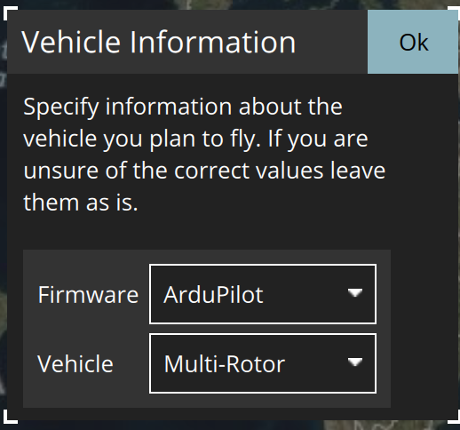
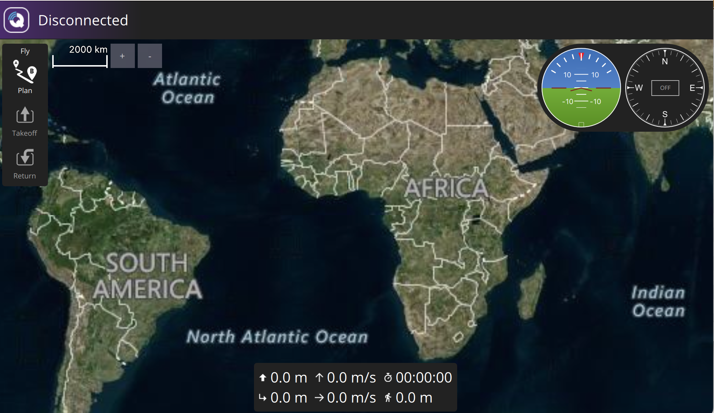

AERPAW is a wireless research platform for experiments involving advanced wireless technologies (such as 5G) and autonomous drones. 

AERPAW experiments begin in Development Mode, in the AERPAW Virtual Environment, before they are deployed on the physical testbed in live flight. In this tutorial, you will configure the software you'll need on your own device, create an account on AERPAW, and run an example experiment in the AERPAW Virtual Environment. 


>[!NOTE] 
>This process has a “human in the loop” approval stage - students will need to wait for an instructor or research advisor to approve their request to join their project. They should be prepared to start the tutorial, wait for this approval, and then continue.


## Prepare your workstation 

To use AERPAW, you'll need to prepare your workstation (the laptop or PC you are going to use for your experiments) with the following software:

* Terminal application for SSH (and keys)
* QGroundControl
* OpenVPN

#### Terminal application

You will need a terminal application with SSH to connect to your AERPAW resources. You may use the built-in terminal on Linux or Mac. On Windows, you may use [cmder](https://cmder.app/) or any other terminal application that has an SSH client.

#### QGroundControl 

AERPAW uses QGroundControl to monitor and control moving vehicles - including ground and aerial vehicles - during experiments in the AERPAW Virtual Environment.

To install QGroundControl, follow the instructions in the [QGroundControlGuide](https://docs.qgroundcontrol.com/Stable_V4.3/en/qgc-user-guide/getting_started/download_and_install.html) for your specific platform (Windows, Mac, or Linux).

During the setup, you will be prompted to specify certain settings, please use:

* Unit system: metric 
* Autopilot: ArduPilot
* Frame: Quad




When you run QGroundControl for the first time, it will look like this:



#### OpenVPN 

To connect to resources in the AERPAW virtual environment, you will need to set up a VPN connection from your own device to the AERPAW environment, using an OpenVPN client.

The [AERPAW User Manual](https://sites.google.com/ncsu.edu/aerpaw-wiki/aerpaw-user-manual/2-experiment-lifecycle-workflows/2-6-experiment-access-workflow#h.m45jkgvsom69) recommends:

* On Linux: OpenVPN version 2 (not Version 3, which does not support AERPAW VPNs). It can be installed on Ubuntu with `sudo apt install openvpn`, or on any Linux distribution by installing [from source](https://github.com/OpenVPN/openvpn/).
* On Mac: [Tunnelblick](https://tunnelblick.net/downloads.html) is the recommended software. 
* On Windows: [OpenVPN client for Windows](https://openvpn.net/community-downloads/).


## Create an account on AERPAW

Before you can run an experiment on AERPAW, you will need to:

* create an account
* edit your profile
* add SSH keys to your profile
* request an experimenter role
* join a project

#### Create your AERPAW account

First, you will create an account on the AERPAW experiment portal. 

1. From the AERPAW website [https://aerpaw.org](https://aerpaw.org), click "Experiment Web Portal" from the menu.
2. Choose "Login" in the top right. 
3. Click on "AERPAW Login."
4. In the "Select Identity Provider" section, click on the dropdown menu and find your institution. Then, click "Log On". You will be redirected to log in using your institutional credentials.
5. Then, you will be returned to the AERPAW experiment portal homepage, but you will see a navigation bar at the top of the page with additional item ("Profile") and "Logout" instead of "Login", indicating that you are now logged in.
6. On your first login, you will also receive an email welcoming you to AERPAW.

> In some cases, after Step 3, you may still be logged out and have to repeat steps 2 through 4 a second time. This is a known issue related to the way identity-related information is cached and sent by your browser.

#### Edit your AERPAW profile

Before you can use AERPAW, you are required to update your profile to provide some basic information about yourself. The AERPAW team will review this information to confirm that you are eligible to use AERPAW.

Once you are logged in to the AERPAW experiment portal,

1. Click "Profile" in the navigation bar at the top.
2. In the "Employer/Organization" field, indicate your affiliation (e.g. your school).
3. In the "Position/Title" field, indicate your position (e.g. "Student", "Summer Research Intern", etc.).
4. Describe your anticipated use of AERPAW in the "Field of Research" field. You can write something like "Run wireless network experiments" or "Lab assignment for my course with Prof. Fraida Fund" or similar.
5. Click "Update Profile" to save your entries.

#### Generate SSH keys

Next, you will add SSH keys to your AERPAW profile. You will use these keys when connecting to resources in the AERPAW virtual environment.

> Note: If you already have an SSH key pair, you can use it with AERPAW - copy the contents of the public key, then skip to the "Upload SSH keys to your AERPAW profile" section and continue there. If you don’t already have an SSH key pair, continue with the rest of this section. 

SSH public-key authentication uses a pair of separate keys (i.e., a key pair): one “private” key, which you keep a secret, and the other “public”. A key pair has a special property: any message that is encrypted with your private key can only be decrypted with your public key, and any message that is encrypted with your public key can only be decrypted with your private key. 

This property can be exploited for authenticating login to a remote machine. First, you upload the public key to a special location on the remote machine. Then, when you want to log in to the machine: 

* You use a special argument with your SSH command to let your SSH application know that you are going to use a key, and the location of your private key. If the private key is protected by a passphrase, you may be prompted to enter the passphrase (this is not a password for the remote machine, though).
* The machine you are logging in to will ask your SSH client to “prove” that it owns the (secret) private key that matches an authorized public key. To do this, the machine will send a random message to you.
* Your SSH client will encrypt the random message with the private key and send it back to the remote machine.
* The remote machine will decrypt the message with your public key. If the decrypted message matches the message it sent you, it has “proof” that you are in possession of the private key for that key pair, and will grant you access (without using an account password on the remote machine.)

(Of course, this relies on you keeping your private key a secret.)

We’re going to generate a key pair on our laptop, then upload it to our AERPAW profile.

Open a terminal, and generate a key named `id_rsa_aerpaw`:

```
ssh-keygen -t rsa -f ~/.ssh/id_rsa_aerpaw
```

Follow the prompts to generate and save the key pair. The output should look something like this: 

```
$ ssh-keygen -t rsa -f ~/.ssh/id_rsa_aerpaw
Generating public/private rsa key pair.
Enter file in which to save the key (/users/ffund01/.ssh/id_rsa_aerpaw):
Enter passphrase (empty for no passphrase):
Enter same passphrase again: 
Your identification has been saved in /users/ffund01/.ssh/id_rsa_aerpaw.
Your public key has been saved in /users/ffund01/.ssh/id_rsa_aerpaw.pub.
The key fingerprint is:
SHA256:z1W/psy05g1kyOTL37HzYimECvOtzYdtZcK+8jEGirA ffund01@example.com<br>
The key's randomart image is:
+---[RSA 2048]----+
|                 |
|                 |
|           .  .  |
|          + .. . |
|    .   S .*.o  .|
|     oo. +ooB o .|
|    E .+.ooB+* = |
|      oo+.@+@\.\o|
|        ..o==@ =+|
+----[SHA256]-----+
```

If you use a passphrase, make a note of it somewhere safe! (You don’t have to use a passphrase, though - feel free to leave that empty for no passphrase.)

You will need the contents of your public key in the next step. To see your public key from the terminal, run

```
cat ~/.ssh/id_rsa_aerpaw.pub
```

The output will start with `ssh-rsa`, e.g.

```
ssh-rsa AAAAB3NzaC1yc2EAAAADAQABAAABgQDDTquOzOx/1MEMpxnzWWsSZ/TOpbNygzbVViFeoGWXAIY/qkdr7X/Zql9R/hrZU/Podi/U0Q/KbaW5j9gN/cGQ4X8Lo1kc2euMfgfDBaK/GzIIx0ob1LDeWkF1MB2XjtzOHGrjx/lBkRho3eYleJ2D9tdIGZq+aLQU5IZ8m7P5Odigsax+W5YHRIe3A0LYHxQD7gkerkwq7QcGxY9FPDVFG3Ut2i++iydfXL0gdAwVLHWI8g28eDuoAqTbenL/pp//gfA5bBiEbSb59u+kMX+/SPT/WrbGIZEHdAo2kU659/t81IRySdwUGPi3kaLgmjpDvsw9ItQKFeL/Y2hCiQt28x3oe2dAytFvjufRF/oZuSohGF+LbMi9YPkLL+IxGG5+rGucTQcLP7ATObsvqbxVvvr7koiMNJfb1VIgRQmJ4neWCbhKm4XmYo8Edd6A/ogucHrhCzFYSzunhWbYQCXaxPL4Kpu+TBWDVsP0nwSP4VP+8ATEchnCOguPXG8L0UM= ffund@ffund-XPS-13-9300
```

This text string is your public key. You can copy it from the terminal output.


#### Upload SSH keys to your AERPAW profile

Once you are logged in to the AERPAW experiment portal,

1. Click "Profile" in the navigation bar at the top.
2. In the "Public Credentials" section, click "Add your own".
3. Specify a name for your key (any name you would like to use).
4. Paste the contents of the public key into the "Public key" section.
5. Click "Save".
6. You should now see your key listed in the "Public Credentials" section of your profile.

#### Request an experimenter role


Just after you create your account, your profile will show "No Roles Found" in the Roles section. Before you can run any experiment on AERPAW, you need to request the "Experimenter" role.

Once you are logged in to the AERPAW experiment portal,

1. Click "Profile" in the navigation bar at the top.
2. Next to "Roles", click the blue button that says "review the AERPAW AUP first". This will open the AERPAW Acceptable Use Policy for you to review.
3. Then, click the green button that says "request Experimenter role".
4. The screen will refresh itself to show the pending request in the "Roles" section.
5. Wait until you receive email notification from the AERPAW team that your request has been approved.

Once you have been granted the experimenter role, then when you log in to the AERPAW experiment portal, you will have additional menu options in the navigation bar: "Profile", "Resources", "Projects", "Experiments".

#### Join a project

Finally, you need to join a project that is overseen by your instructor or research advisor. Find out the name of the project from your supervisor. 

Once you are logged in to the AERPAW experiment portal,

1. Click "Projects" in the navigation bar at the top.
2. Put the project name in the search bar and click "Search".
3. Click the "Join" button for your project.

This will automatically send an email request to your supervisor.  Once they have approved your request, you will receive email notification that you have been added to the project.


## Start an experiment

Now, you are ready to run an experiment on AERPAW!

In this "Hello, AERPAW" experiment, you are going to set up an experiment with two mobile vehicles: one aerial vehicle (UAV) and one ground vehicle (UGV). 

#### Add members and resources to your experiment

First, log in to the AERPAW Experiment Portal. Click on "Projects" in the navigation bar, and find the project that you are a member of; click on it to open the project overview. Click on the "Create" button in the "Experiments" section. 

>[!NOTE] 
>Usually, before you begin an experiment on AERPAW you will fill in the "AERPAW Experiment Information Request Form" at this stage. However, if you're completing "Hello, AERPAW" as part of your coursework, your instructor will have completed this form already on your behalf, and you can skip this step.

Give your project a "Name" (you may use the template `hello_username`, e.g. `hello_ffund` in my case, for the experiment name) and a "Description" (e.g. "Deploy a UAV and UGV") and then click "Save".

From the experiment page, you will add members and resources to the experiment: 

<image src="https://github.com/weijiekwang/AERPAW/assets/123581716/fe7d3675-abc3-4895-ad4f-63b43d5e9aec" width="200px">

Click on the "Update" button next to "Members". Select your course instructor or research advisor, click on the arrow to the move them to the list of "Chosen Members", then click "Save".

Back on the experiment page, click on the "Update" button next to "Targeted Resources". On this page, you will add two resources to the experiment (in the specified order): first select LPN1 (this will be the UAV, which is assumed to be the first vehicle in the rest of the instructions) and then select SPN-Android (this will be the UGV, which is assumed to be the second vehicle in the rest of the instructions):

<image src="https://github.com/weijiekwang/AERPAW/assets/123581716/0acd0690-26f2-4f40-a85b-89f7379c6bc2" width="800px">

Click "Save". Then, you will modify each of the nodes by clicking "Modify" - 

<image src="https://github.com/weijiekwang/AERPAW/assets/123581716/234e6b93-b6df-4a4c-8721-59778790359a" width="800px">

* for node 1 (LPN1), change the "Node Vehicle" property to "vehicle_uav" and click "Save"
* for node 2 (SPN-Android), change the "Node Vehicle" property to "vehicle_ugv" and click "Save"

<image src="https://github.com/weijiekwang/AERPAW/assets/123581716/d347737f-0e95-4218-a504-90190205a1d5" width="200px">
<image src="https://github.com/weijiekwang/AERPAW/assets/123581716/42cfb511-da48-4b5c-ba7b-e7af987bf942" width="200px">

Click "Back to Experiment", then "Initiate Development".

<image src="https://github.com/weijiekwang/AERPAW/assets/123581716/5229775b-ca15-4e9d-8b33-6cb9bb8113df" width="800px">

You will receive an email with the subject "Request to initiate development session". You must then wait until you receive another email notification indicating that the development session is active.

## Access experiment resources

At this stage, you are ready to access experiment resources!

#### Start VPN

>[!NOTE]
>**For Mac users**: AERPAW VPNs use something called a `tap` interface. On some versions of MacOS you may need to take some additional steps in order to use a `tap` interface - refer to the instructions [here](https://tunnelblick.net/cKextLoadError.html) for your specific OS version.

#### Start SSH session

#### Connect QGroundControl to your experiment

#### Execute radio and mobility applications in your experiment

